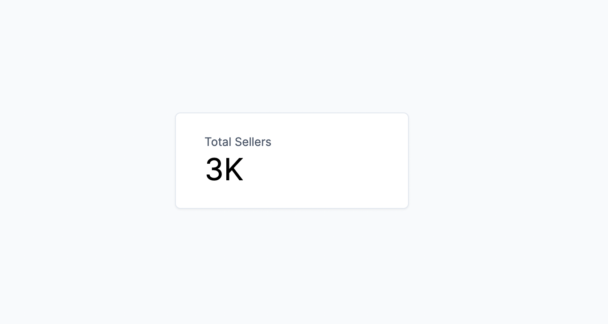
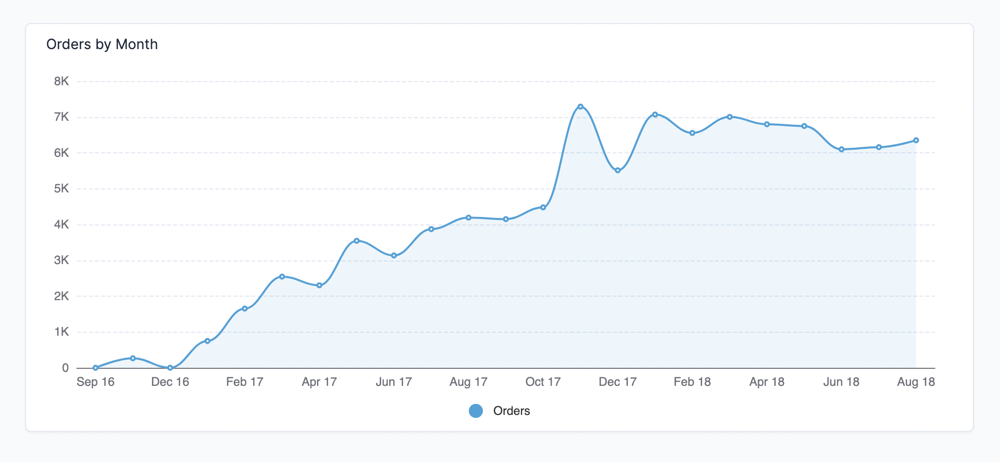
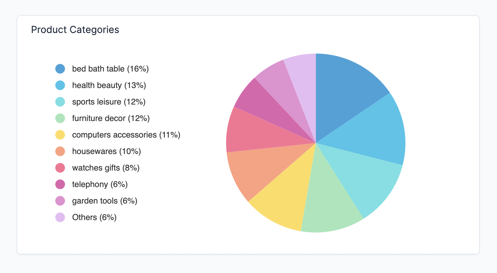

# Charts

A query can be visualized as a chart. You can add a chart to a dashboard by clicking the **Edit** button in the top right corner of the dashboard and dragging the chart widget to the dashboard.

## Chart types

You can choose between the following chart types:

- **Number**

- **Progress**

- **Line chart**

- **Bar chart**

- **Pie chart**

- **Table**

