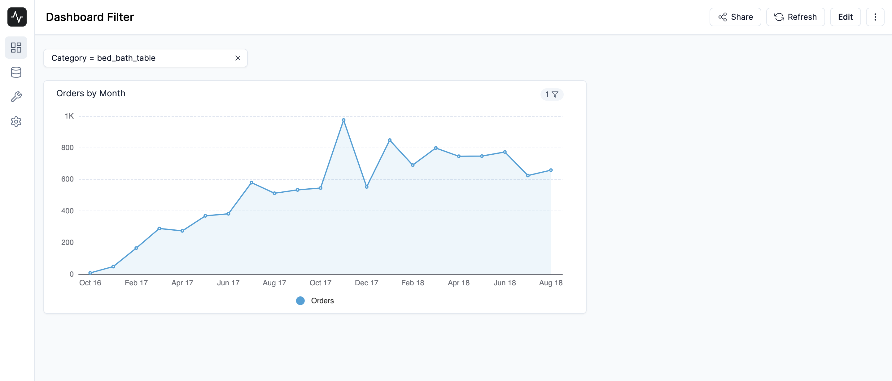

# Dashboard Filters

Dashboard filters allow you to filter the data in your dashboard. You can filter by a specific value, or by a range of values. You can also filter by a specific time period. You can add multiple filters to a dashboard.

## Adding a filter

To add a filter to a dashboard, click the **Edit** button in the top right corner of the dashboard. Then, drag and drop the **Filter Box** widget from the **Widgets** panel to the dashboard. You can then enter the title of the filter and select the column you want to filter by.	

Once you have selected the column you want to filter by, you will have to link the filter to the charts in your dashboard. To do this, click the **Toggle** button beside the chart you want to link the filter to. Then, select the column of from the chart you want to filter by.

Once you have configured the filter, click the **Save** button in the top right corner of the dashboard. Now you can use the filter to filter the data in your dashboard.

