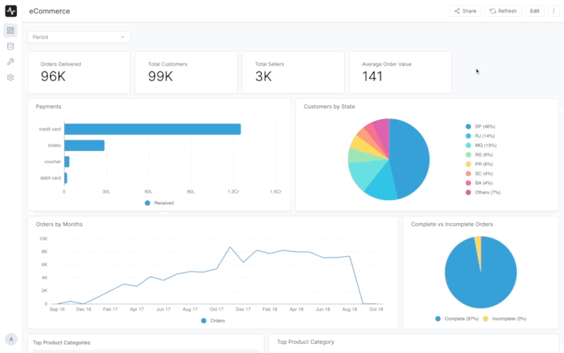

# Dashboards

Dashboards are a group of related visualizations that you can use to track and monitor your data. You can share a dashboard with your team or subscribe to it to receive regular notifications.

A Dashboard is a grid which contains cards. Cards can be a chart, a filter, a table, or a text box. You can add as many cards as you want to a dashboard.

## Add a card

To add a card to a dashboard, click the **Edit** button in the top right corner of the dashboard. You'll see a list of all the widgets you can add to the dashboard. You can **drag and drop** the widgets you want to add to the dashboard.

## Edit a card

To edit a card, click the **Edit** button in the top right corner of the dashboard and click on the card you want to edit. You'll see a sidebar with all the options to edit the card.

You can also delete a card by clicking the **Delete** button at the bottom of the sidebar.

## Reorder cards

To reorder cards, click the **Edit** button in the top right corner of the dashboard. You can then **drag and drop** the cards to reorder them.

Don't forget to click the **Save** button at the bottom of the sidebar to save your changes.