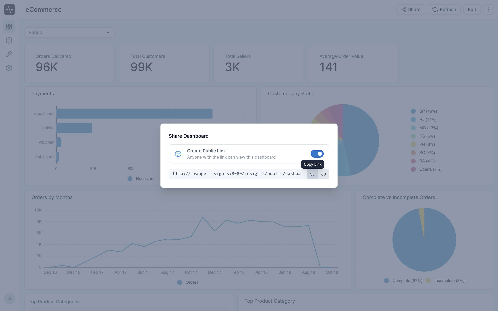

# Sharing Dashboards

You can create a unique URL for your dashboard to share it with your team with or without having to log in to Insights. This URL can also be used to embed the dashboard in any website or application.

To generate a unique URL for your dashboard, click the **Share** button in the top right corner of the dashboard. You'll see a popup with the URL for your dashboard.

