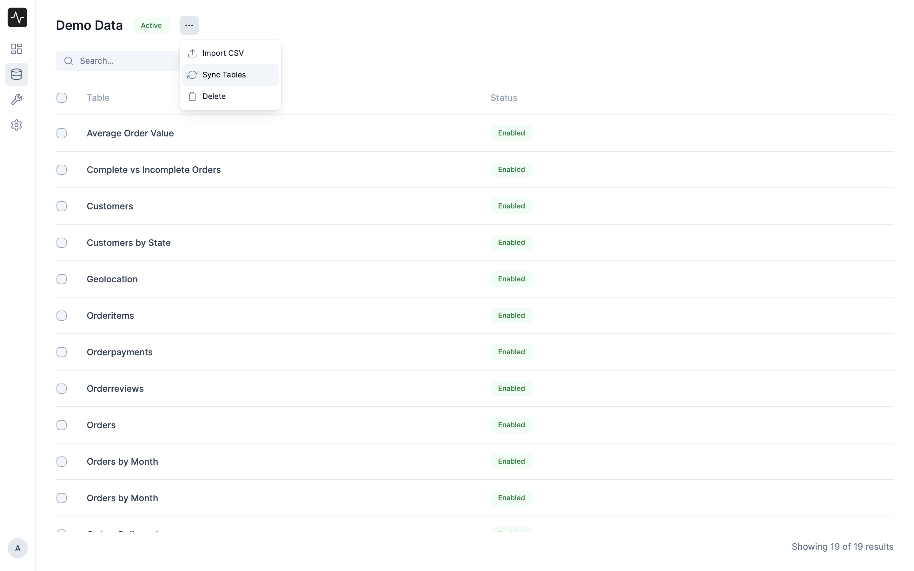

# Data Source

Insights allows you to connect and analyze various data sources. You can add multiple data sources to process and combine data from different databases. 

## Adding a Data Source

To add a new data source, go to the **Data Sources** tab, and click on **New**. You can add following types of data sources:

- Remote MySQL Database
- Local SQLite Database
- CSV File

::: tip Application's Database
By default, Insights creates a data source to connect to the App's database. You can use this data source to query the App's database.
:::

### Adding a Remote MySQL Database

You can add a remote MySQL database by entering the database credentials.

Here's what you will need to connect to your database:
- The **hostname** of the server where your database is (leave empty for localhost)
- The **port** of the database server (leave empty for default port)
- The **database name** of the database you want to connect to
- The **username** you use for the database (preferably a user with read-only privileges)
- The **password** you use for the database

::: tip Use SSL
If you are connecting to a remote database, you must keep it enabled
:::

::: tip Connect to Frappe Cloud Site
If your site is hosted on Frappe Cloud, check out these [instructions](../miscellaneous/faq#q-my-site-is-hosted-on-frappe-cloud-how-do-i-connect-to-my-database) get the database credentials.
:::

## Syncing Schema

Once you have added a data source, Insights will automatically sync the schema of the database. You can click on the Data Source to view the list of tables.

You can also manually sync the schema by clicking on the **Sync Tables** button under the 3-dot menu.

