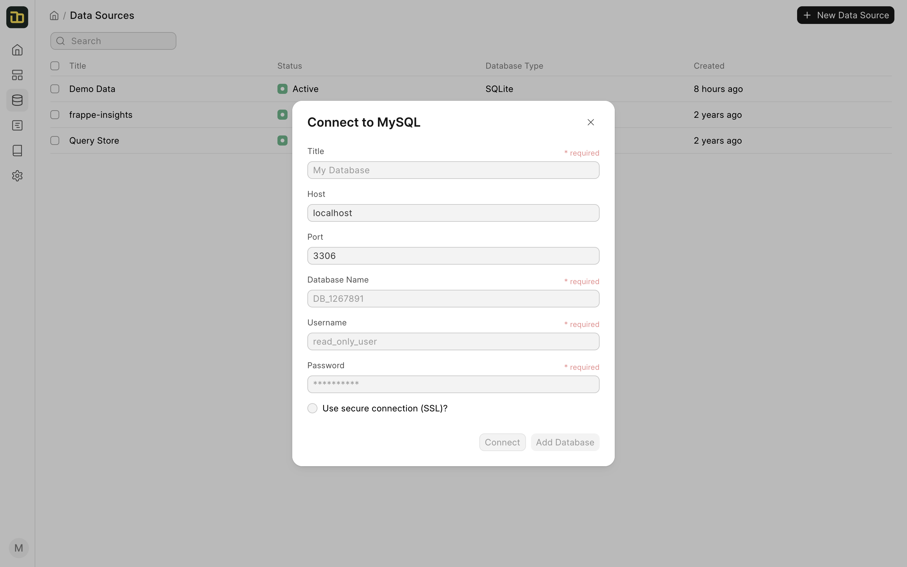
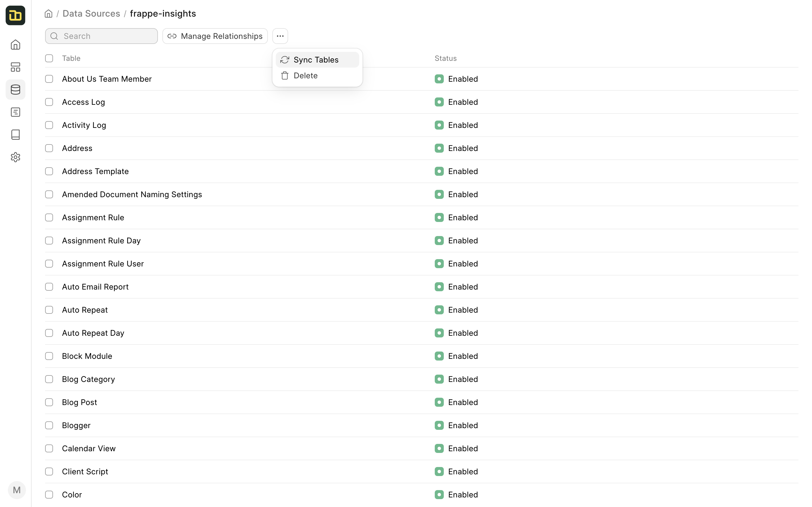
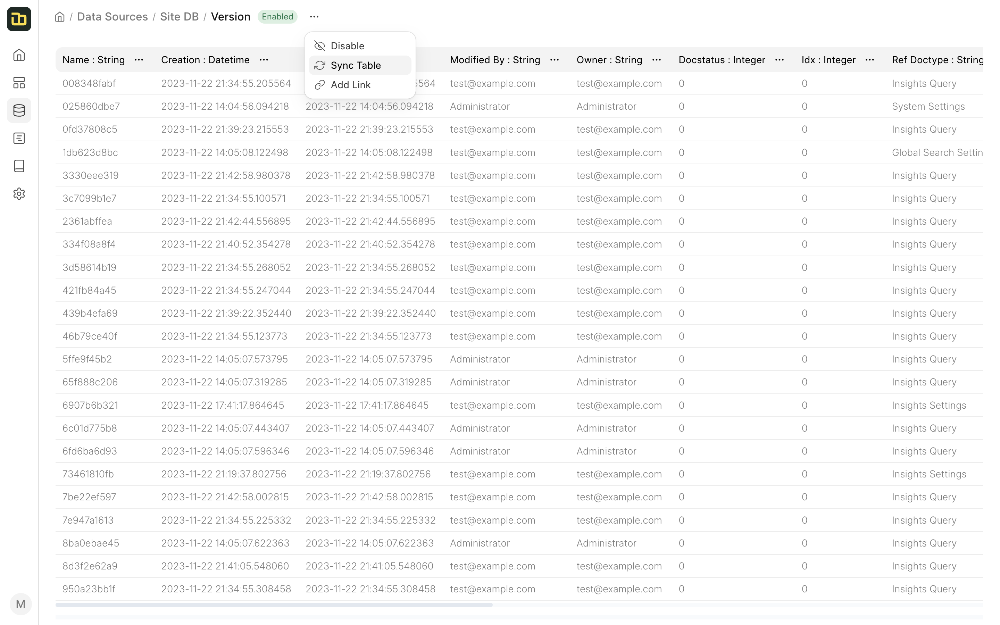

# Data Source

Insights allows you to connect and analyze various data sources. You can add multiple data sources to process and combine data from different databases. 

## Adding a Data Source

To add a new data source, go to the **Data Sources** tab, and click on **New**. You can add following types of data sources:

- Remote MySQL Database
- Local SQLite Database
- CSV File

### Adding a Remote MySQL Database

You can add a remote MySQL database by entering the database credentials.

Here's what you will need to connect to your database:
- The **hostname** of the server where your database is (leave empty for localhost)
- The **port** of the database server (leave empty for default port)
- The **database name** of the database you want to connect to
- The **username** you use for the database (preferably a user with read-only privileges)
- The **password** you use for the database

::: tip Use SSL
If you are connecting to a remote database, you must keep it enabled
:::

::: tip Connect to Frappe Cloud Site
If your site is hosted on Frappe Cloud, check out these [instructions](../miscellaneous/faq#q-my-site-is-hosted-on-frappe-cloud-how-do-i-connect-to-my-database) get the database credentials.
:::

## Standard Data Sources

Insights comes with two standard data sources:
- **Demo Data** - This data source contains a sample dataset of an ecommerce store. It has multiple tables that contain data about the orders, customers, products, etc.
- **Site Database** - This data source contains the data from your site's database. You can use this data source to analyze the data from your site.
- **Query Store** - This data source is used to store the results of the queries that you run. You can use this data source to perform cross-data source analysis.

::: tip Underlying Database
The **Demo Data** and **Site Database** data sources are backed by a SQLite database. They are stored in your site's private files, where files that are uploaded to the site are stored.
:::

## Syncing Schema

Once you have added a data source, Insights will automatically sync the schema of the database. You can click on the Data Source to view the list of tables.

You can also manually sync the schema by clicking on the **Sync Tables** button under the 3-dot menu.

You can also manually sync the schema of a table by clicking on the **Sync Table** button under the 3-dot menu.

