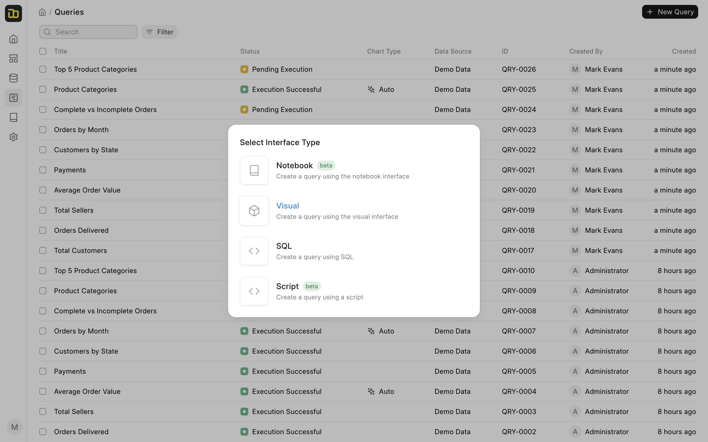
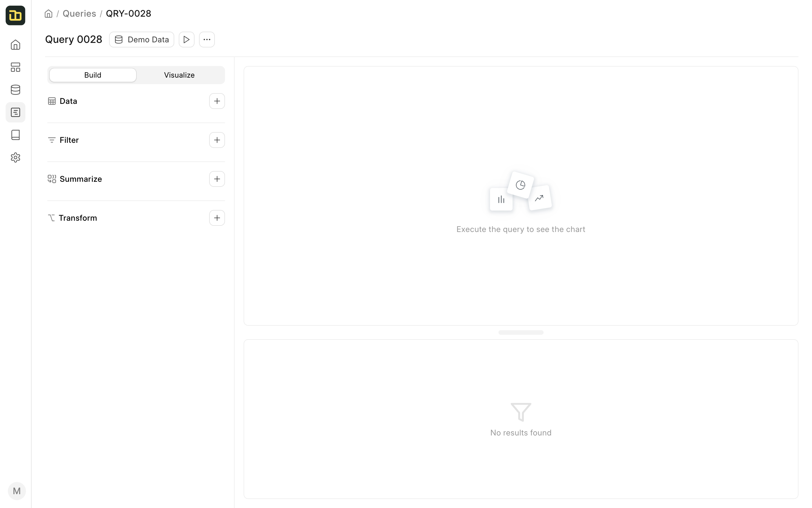
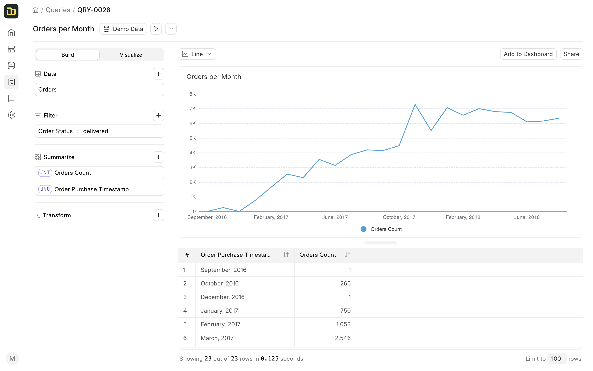
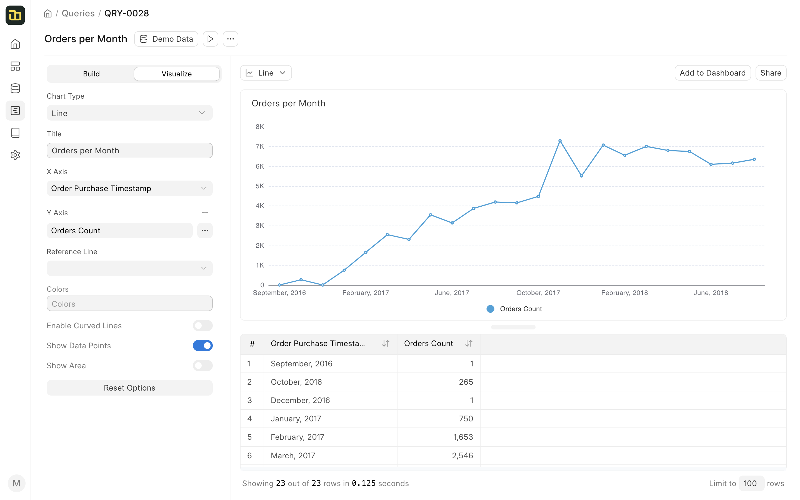

# Quick Start Guide

Once you have set up your data sources, you can start querying your data from your data sources. Frappe Insights makes it very easy to query your data with its best-in-class query builder. You can then quickly create visualizations and dashboards from your queries.

To demonstrate the core features of Insights, we will be using the **Demo Data** that comes with Insights. This data is a sample dataset of an ecommerce store. It has multiple tables that contain data about the orders, customers, products, etc.
We will be using the **Orders** table for this guide.

## Querying Data

The query builder is the main interface for querying your data. It is available in the \***\*Query\*\*** tab in the sidebar.

_Query Builder_

You can click on any existing query to edit it or click on the \***\*Create New Query\*\*** button to create a new query. Once you click on the \***\*Create New Query\*\*** button, you will have to select an interface to create the query. There are 4 types of interfaces available:

- **Visual Query Builder** - This is the default interface for creating queries. It is a visual interface that allows you to create queries without writing any SQL.
- **Native Query Builder** - This interface allows you to write SQL queries directly. You can use this interface if you are familiar with SQL.
- **Script Query Builder** - This interface allows you to write Python scripts to create queries. You can use this interface if you are familiar with Python.
- **Notebook Editor** - This interface allows you to add different types of blocks to create queries or report. It is similar to Jupyter Notebooks.

_Create New Query_

We will be using the **Visual Query Builder** interface to create our query. Once you select the interface, you will be taken to the query builder.

The query builder has 3 sections:

- **Build**: The sidebar on the left is used to build the query. It has 3 sections:
  - **Data**: This section is used to select the data source and the table.
  - **Filter**: This section is used to add filters to the query.
  - **Summarize**: This section is used to select columns and perform aggregations on them.
  - **Transform**: This section is used to perform transformations on the data, for example, pivot tables.
- **Chart**: This section is used to display the visualization of the query.
- **Result**: This section is used to display the result of the query.

To make a basic query to get the _total number of orders_, follow the steps below:

1. Select the **Demo Data** data source from the **Data Source** dropdown.
2. Select the **Orders** table by clicking on the **+** icon next to the **Data** section.
3. Select the **Orders Count** column from the **Columns** section's **+** icon.
4. Click on **Execute** to execute the query.

Now, let's add a dimension to the query to get the _total number of orders placed per month_.

1. Select the **Order Purchase Date** column from the **Columns** section.
2. Also add a **Filter** to find only the orders that are delivered.

You should end up with a query like this:

## Visualization Options

As you go on adding columns and filters to your query, Insights will automatically create a visualization for you. You can also select the visualization type from the **Chart Type** dropdown and to customize the visualization, switch to the **Visualize** tab.

Once you are satisfied with the visualization, you can add it to a dashboard. Click on the **Add to Dashboard** button to add the visualization to a dashboard. To add this visualization you'll need to create a dashboard first.

