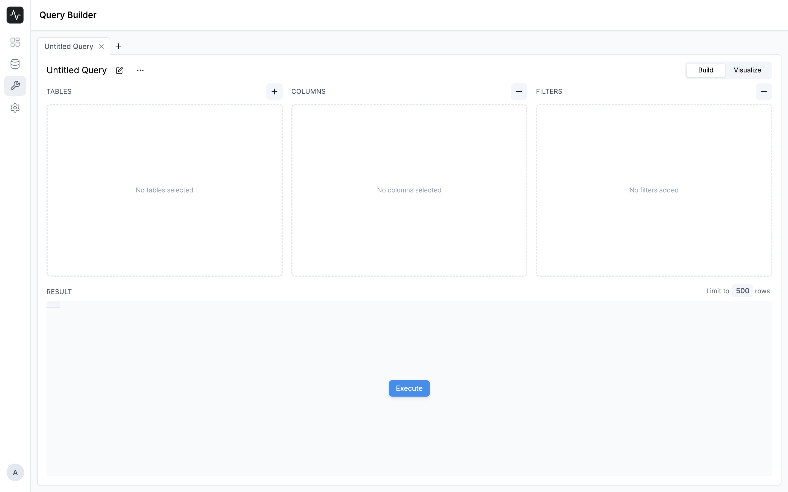
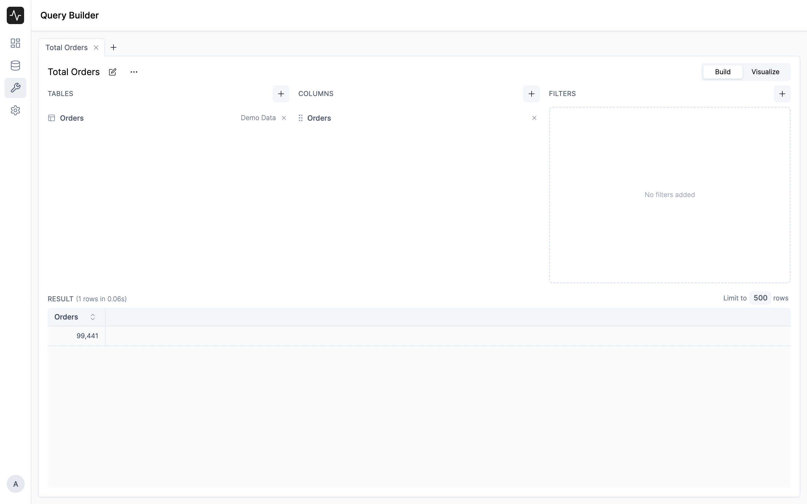
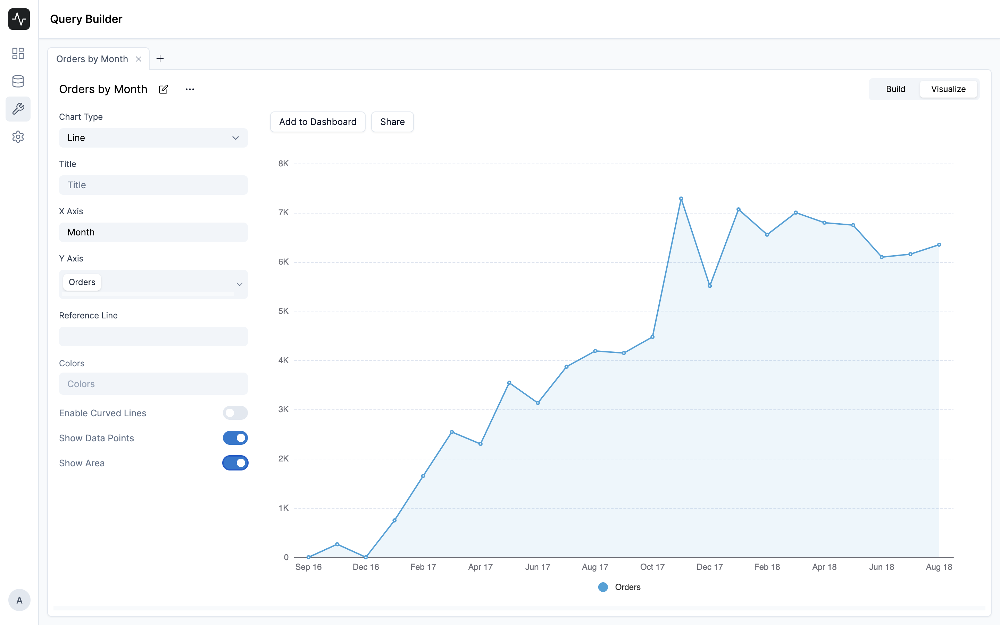

# Quick Start Guide

Once you have set up your account, you can start querying your data from your data sources. Frappe Insights makes it very easy to query your data with its best-in-class query builder. You can then quickly create visualizations and dashboards from your queries. 

We will be using the **Orders** data source from the **Demo Data** that comes with Insights to demonstrate the features.

## Querying Data

The query builder is the main interface for querying your data. It is available in the ****Query**** tab in the sidebar.

*Query Builder*

You can click on any existing query to edit it or click on the ****Create New Query**** button to create a new query. Once you click on the ****Create New Query**** button, you will have to select a data source from the list of available data sources. After selecting a data source, you will be able to see the Query Builder interface.

There are three main sections in the query builder:

- **Tables** - This section is used to select a table from the data source. You get options to join tables here.
- **Columns** - This section is used to select columns and perform aggregations on them. You can also add custom columns here.
- **Filters** - This section is used to select filters. You can add simple or advanced filters here. You can even write logical expressions here.

To make a basic query to get the _total number of orders_, follow the steps below:

1. Select the **Orders** table from the **Tables** section.
2. Select the **Count** aggregation from the **Aggregation** dropdown in the **Columns** section.
3. Click on **Execute** to execute the query.

Now, let's add a dimension to the query to get the _total number of orders placed over the years_.

1. Select the **Order Purchase Date** column from the **Columns** section.
2. Select the **Group By** option from the **Aggregation** dropdown.
3. Select the **Month** option from the **Date Format** dropdown.
4. You can also add a **Filter** to find only the orders that are delivered.

You should end up with a query like this:

## Visualizing Data

Now that you have a query, you can visualize the data. Go to the **Visualize** tab to create a visualization. Insights tries to _guess_ the best visualization for your query. You can however change the visualization type from the **Chart Type** dropdown.

Once you are satisfied with the visualization, you can add it to a dashboard. Click on the **Add to Dashboard** button to add the visualization to a dashboard. To add this visualization you'll need to create a dashboard first.

## Creating Dashboards

A dashboard is a collection of visualizations. You can create a dashboard by clicking on the **Dashboard** tab on the sidebar. Click on the **New Dashboard** button and enter a suitable name for the dashboard.

