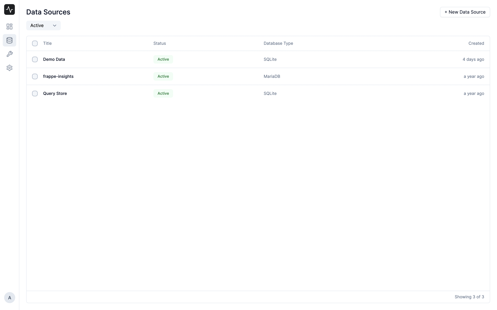

# Setup your account

If you have installed Insights on a brand new site, you will need to set up your account. Visit your site that has Insights installed, and you should see a setup wizard.

*Setup Wizard*

To complete the setup you will need to enter basic information like your country, name, email, and password. Make sure to remember your email and password as this is going to be your [admin account](/miscellaneous/faq#admin-account).

## Setting up Data Sources
After setting up Insights, visit `/insights` or search for **Open Insights** in the awesomebar. You will be taken to the Insights dashboard. The first thing you will need to do is to set up your data sources.

Insights comes with a sample data source called `Demo Data` that you can use to try out the features. You can also connect to your own data sources. Frappe Insights supports a wide range of source types. You can connect to any of the following sources:
  - MySQL/MariaDB
  - SQLite
  - CSV

*Data Sources*