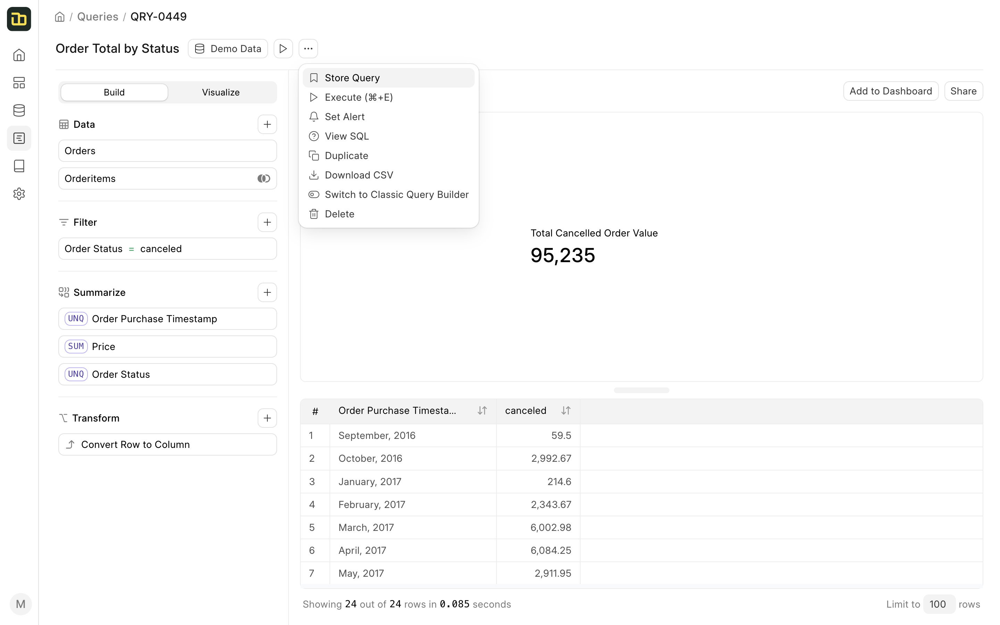

# Cross Database Queries

When you want to create a query that uses tables from multiple data sources, you will have to **store** the data from multiple data sources in a single data source. This can be done by clicking on the **Store Query** option under the **3-dot menu** of the query.

When storing a query, Insights creates a new table or replaces the existing table in the **Query Store** data source that comes pre-configured with Insights. 

After storing multiple queries from multiple data sources, you can create a new query that uses the tables from the **Query Store** data source.

Everytime a query from **Query Store** is executed, Insights will execute the queries from the original data sources and store the result in the **Query Store** data source. This ensures that the data in the **Query Store** data source is always up-to-date.