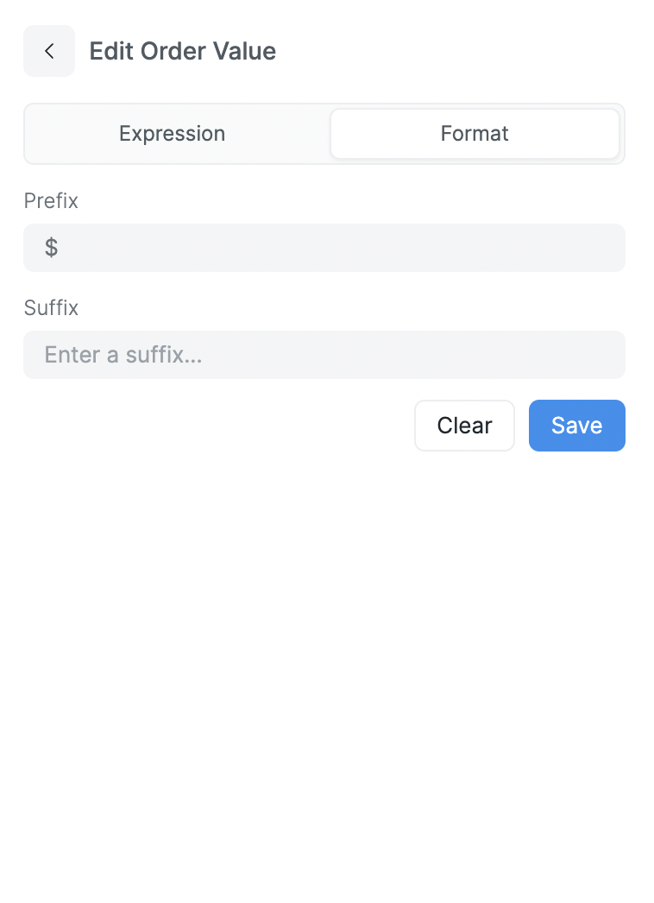

# Dimension and Metrics

Dimensions and metrics are the building blocks of your query. Dimensions are the attributes of your data, and metrics are the measurements of those attributes. Dimensions and metrics are used to create visualizations and dashboards.

Dimensions are used to group your data. For example, if you have a table of sales data, you can group your data by product category to see how much revenue each category is generating.

Metrics are used to measure your data. For example, if you have a table of sales data, you can measure the total revenue generated by each product category.

In this case, the product category is a dimension and revenue is a metric.

## Expressions

You can use expressions to create new metrics from existing metrics or to create new dimensions from existing dimensions. For example, you can create a new metric that calculates the percentage of revenue generated by each product category.

To write an expression, switch to the **Expressions** tab in the Dimensions & Metrics section.

	

::: tip Expression Help
You can start typing a method or function name to see a list of available options. You can also use the autocomplete feature to see an example of how to use the method or function.
:::

You can see the available functions and operators in the [Expressions](./expressions.md) section.

## Formatting

You can format your dimensions and metrics to change the way they are displayed in your visualizations. For example, you can format a metric to display a percentage or a currency.

To format a dimension or metric, click the **Format** button next to the dimension or metric.

	

### Date and Time

You can format date and time dimensions to display the date and time in a specific format. For example, you can format a date dimension to display the date as **January 1, 2020**.

Following are the available date and time formats:
- **January 12, 2020 1:14 PM**
- **January 12, 2020 1:00 PM**
- **January 12, 2020**
- **January, 2020**
- **Q1, 2020**
- **2020**
- **Jan 20**
- **1:00 PM**
- **Monday**
- **January**
- **Q1**

### Number

You can add a prefix or suffix to a number dimension or metric. For example, you can add a **$** prefix to a metric to display the metric as **$100**.