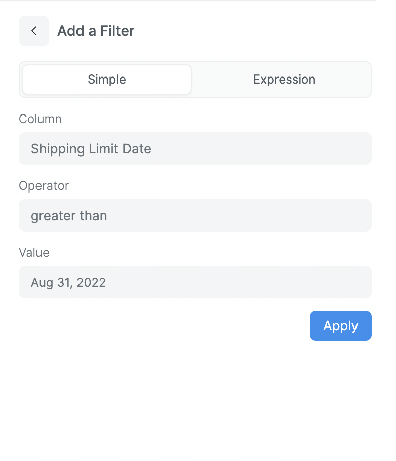

# Filters

Filters are a way to narrow down the data that is displayed in the query result. They are a great way to focus on a specific subset of data. You can add Simple as well as Complex filters to your query.

## Simple Filters

Simple filters are used to filter data based on a single dimension or metric. You can add a simple filter by clicking the **+** button in the filters section.

	

Following are the available operators:

- **equals** - Checks if the column value is equal to the value.
- **not equals** - Checks if the column value is not equal to the value.
- **greater than** - Checks if the column value is greater than the value.
- **greater than equal to** - Checks if the column value is greater than or equal to the value.
- **less than** - Checks if the column value is less than the value.
- **less than equal to** - Checks if the column value is less than or equal to the value.
- **is** - Checks if the column value is set or not.
- **one of** - Checks if the column value is in the list.
- **not one of** - Checks if the column value is not in the list.
- **between** - Checks if the column value is between the two values.
- **within** - Checks if the column value is within the time range.

## Expression Filters

Expression filters are used to filter data based on a complex expression. You can add an expression filter by switching to the **Expression** tab in the filters section.

	

You can see the available functions and operators in the [Expressions](./expressions.md) section.