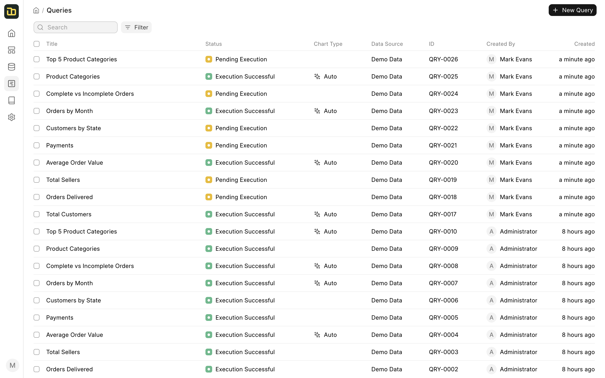

# Query

A Query in Insights represents a SQL query that you can run on your data source. You can create a query by clicking on the **New** button in the **Queries** tab.

You can create a query using 4 type of interfaces:
- **Visual Query Builder**: This is a visual interface to create a query. You can use this interface if you are not familiar with SQL.
- **SQL Editor** - This interface allows you to write SQL queries directly. You can use this interface if you are familiar with SQL.
- **Script Query Editor** - This interface allows you to write Python scripts to create queries. You can use this interface if you are familiar with Python.
- **Notebook Editor** - This interface allows you to add different types of blocks to create queries or report. You can use the combination of SQL and Python to create queries and reports.
