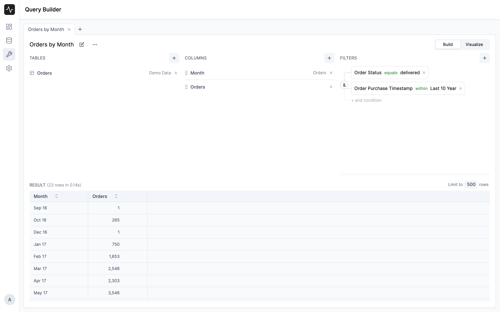

# Query

A Query in Insights represents a SQL query that you can run on your data source. You can create a query by clicking on the **New** button in the **Queries** tab.

## Query Builder

The Query Builder is a visual interface to create a query. You can use the Query Builder to create a query by selecting the data source, tables, and columns. You can also add filters and summarize the data.

Query Builder is divided into 3 sections:

- **Tables**: To select the tables you want to query
- **Columns**: To select the columns and summarize the data
- **Filters**: To filter the data based on conditions
