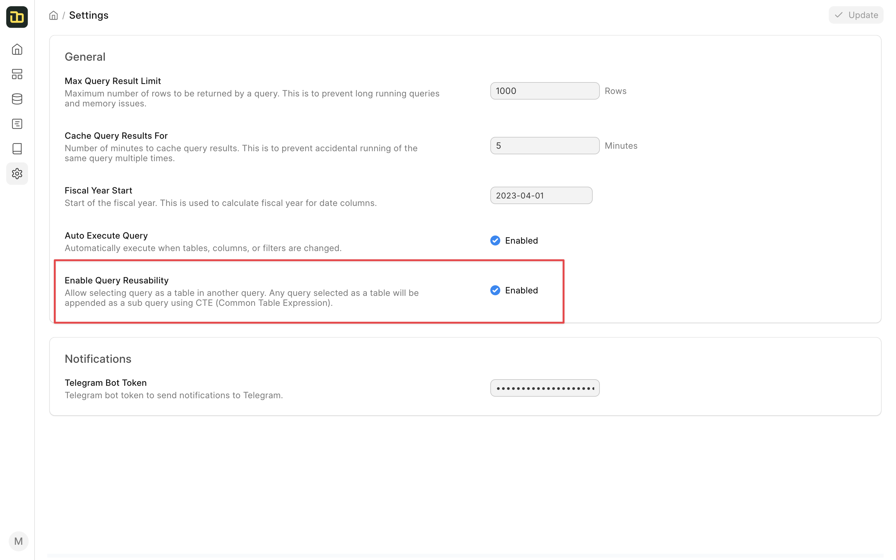
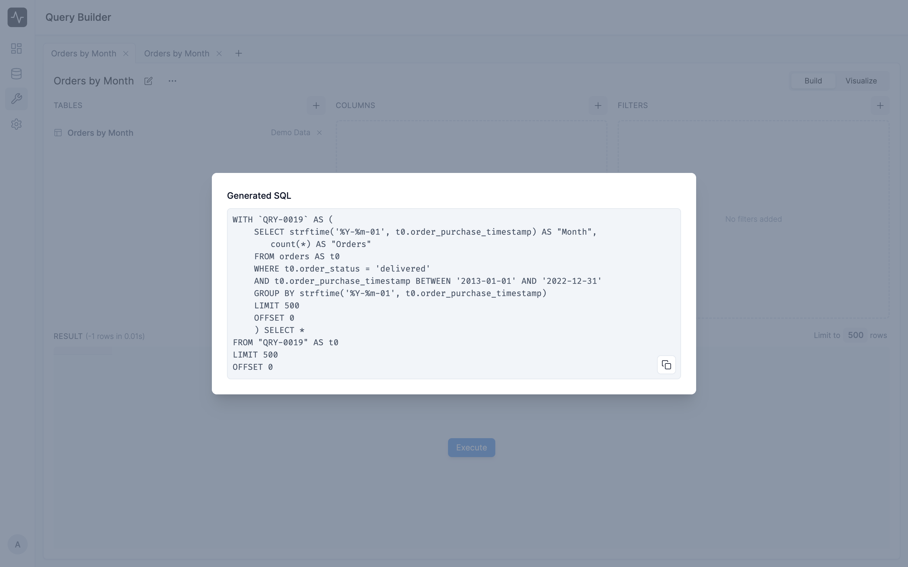

# Reusing Query

A query can be reused as a table in another query. This is useful when you want to create complex queries that are not possible in a single query. 

You can enable query reusability by toggling the **Enable Query Reusability** switch in the **Settings** section of the query.

Once you enable it, Insights will create a new virtual table for each query. You can select the query as a table while selecting the tables for a new query. You can only select the queries that belongs to the same data source.

When using a query as a table, the final SQL that is generated will contain the SQL of the query that you have selected as a subquery. To view the final SQL, click on the **View SQL** button in the 3-dot menu of the query.

