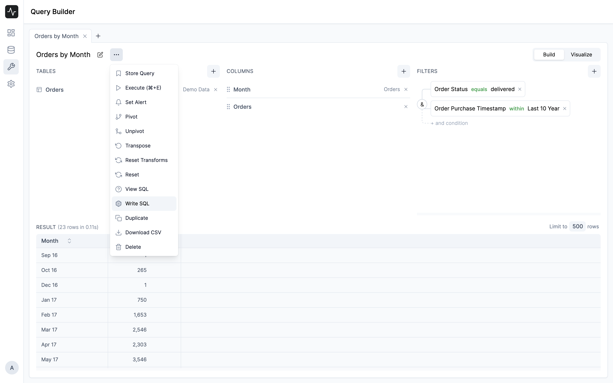

# SQL Editor

The SQL Editor is for technical users who want to write their own SQL queries. It will be helpful to create complex queries that are not possible with the Query Builder.

You can switch to the SQL Editor by clicking on the **Write SQL** button in the 3-dot menu of the query.

You can switch back to the Query Builder by clicking on the **Build SQL** button in the 3-dot menu of the query again.