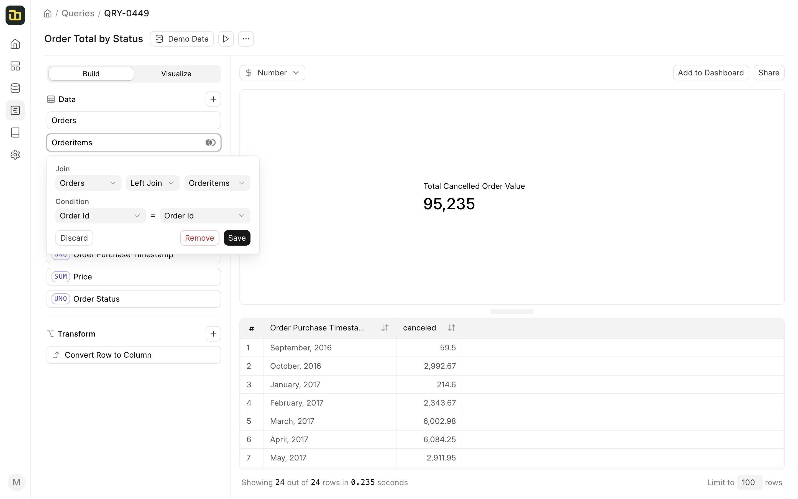
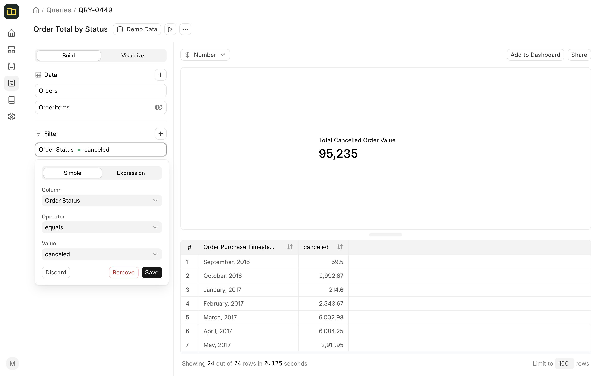
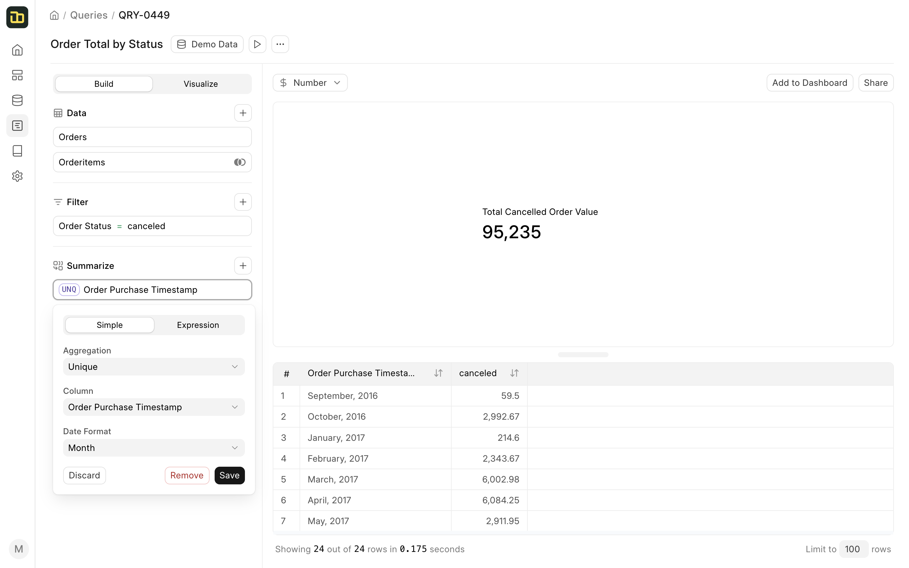
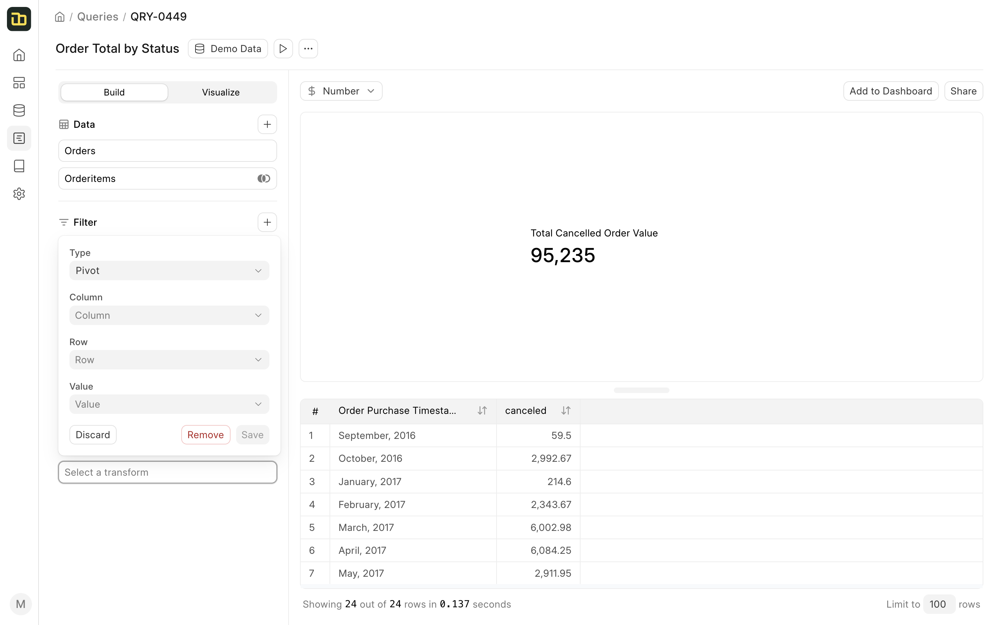

# Visual Query Builder

The visual query builder has 3 sections:
- **Build**: The sidebar on the left is used to build the query. It has 3 sections:
  - **Data**: This section is used to select the data source and the table.
  - **Filter**: This section is used to add filters to the query.
  - **Summarize**: This section is used to select columns and perform aggregations on them.
  - **Transform**: This section is used to perform transformations on the data, for example, pivot tables.
- **Chart**: This section is used to display the visualization of the query.
- **Result**: This section is used to display the result of the query.

### Data

The **Data** section is used to select the data source and the table. Clicking on the **+** button next to the **Data** section will open a popup to select the table.

To join multiple tables, click on the **+** button next to the **Data** section and select the table you want to join. Once you have selected the table, Insights will try to find the join condition automatically. If Insights is not able to find the join condition, you can select the join condition manually.

### Filter

The **Filter** section is used to add filters to the query. You can add a filter by clicking on the **+** button next to the **Filter** section. You can add multiple filters to a query.

You can also write complex filters using the **Expression** tab in the filter popup. You can learn more about the available operators and functions in the [Expressions](#expressions) section.

### Summarize

The **Summarize** section is used to select columns and perform aggregations on them. You can add a column by clicking on the **+** button next to the **Summarize** section.

By default, Insights will perform the aggregation based on the type of column selected. You can however change the aggregation type in the column popup.

You can also write complex aggregations using the **Expression** tab in the column popup. You can learn more about the available operators and functions in the [Expressions](#expressions) section.

### Transform

The **Transform** section is used to perform transformations on the data after the results are fetched from the database, for example, pivot on a column. You can add a transformation by clicking on the **+** button next to the **Transform** section.

Currently, Insights only supports pivot transformations on a set of result that has three columns and one of them is a number column.

You can checkout more on transformations in the [Transformations](#transformations) section.

### Visualize

The **Visualize** tab is used to customize the visualization of the query. You can switch to the **Visualize** tab by clicking on the **Visualize** button next to the **Build** tab.

By default, Insights tries to guess the best visualization for the result set. You can however change the visualization type from the **Chart Type** dropdown.

You can also **Share** the chart with a publicly accessible link and **Add to Dashboard** by clicking on the respective buttons above the chart.

